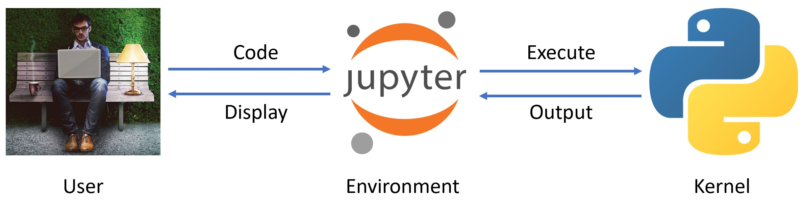

---
# Feel free to add content and custom Front Matter to this file.
# To modify the layout, see https://jekyllrb.com/docs/themes/#overriding-theme-defaults

layout: home
---
Hallo und willkomen zur Einführung in Python mit Jupyter.   

## Ziele

- Installation Jupyter + Python mit [WinPython](http://winpython.github.io/)
- Einführung:
    - Umgang mit Markdown
    - Grundlegende Datenstrukturen
    - Formeln und Variablen
    - Funktionen
    - Module
    - Ablaufsteuerung und Schleifen
    - Daten Import/Export
    - Visualisierung
    
lalelkjsaldjföladf